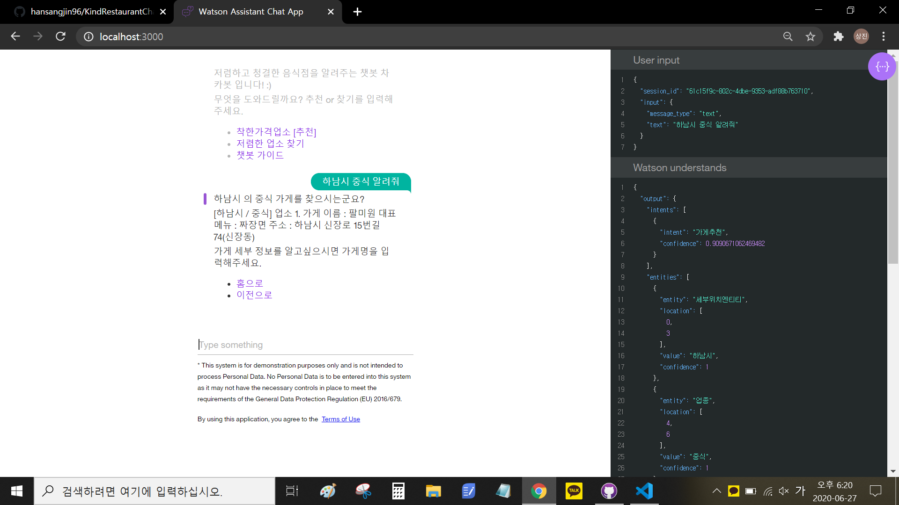
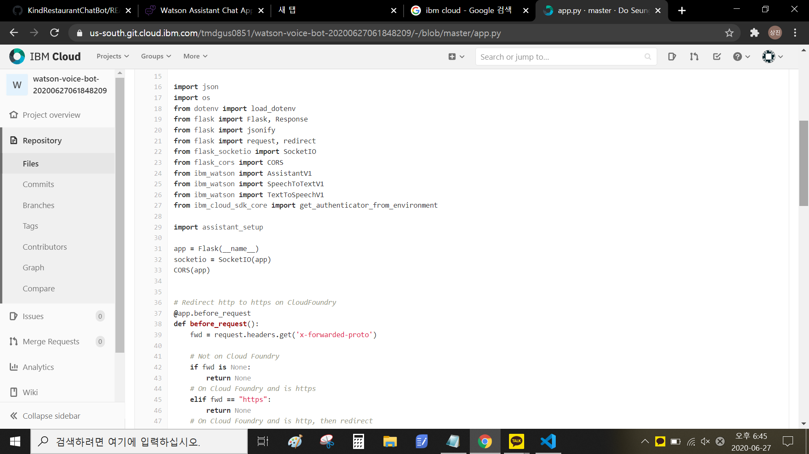
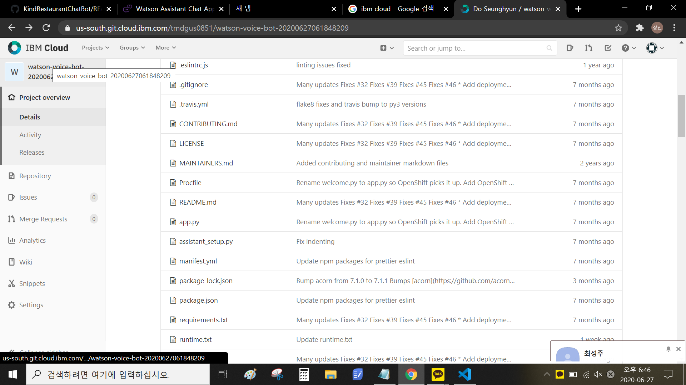
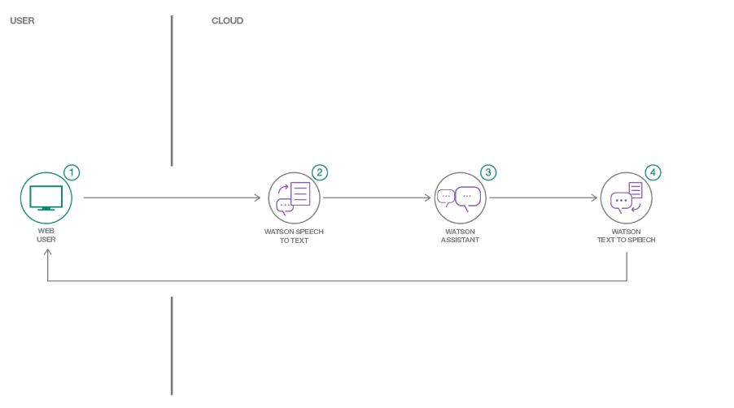
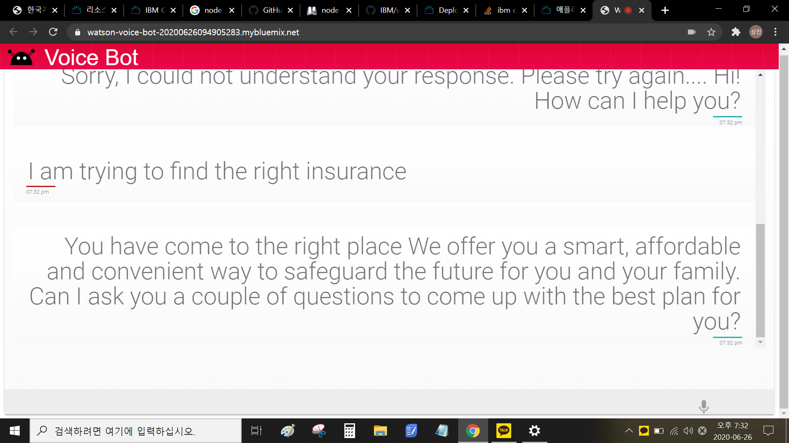
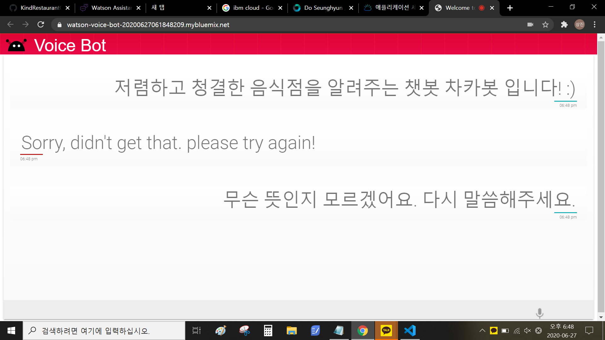
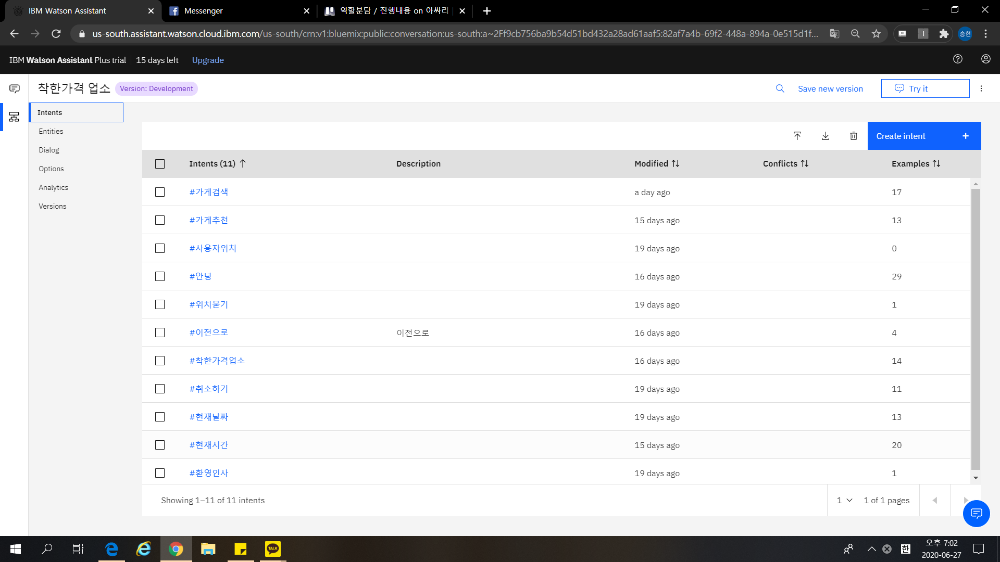
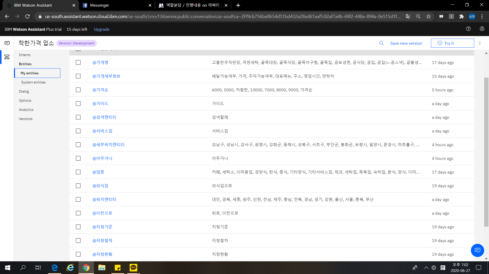
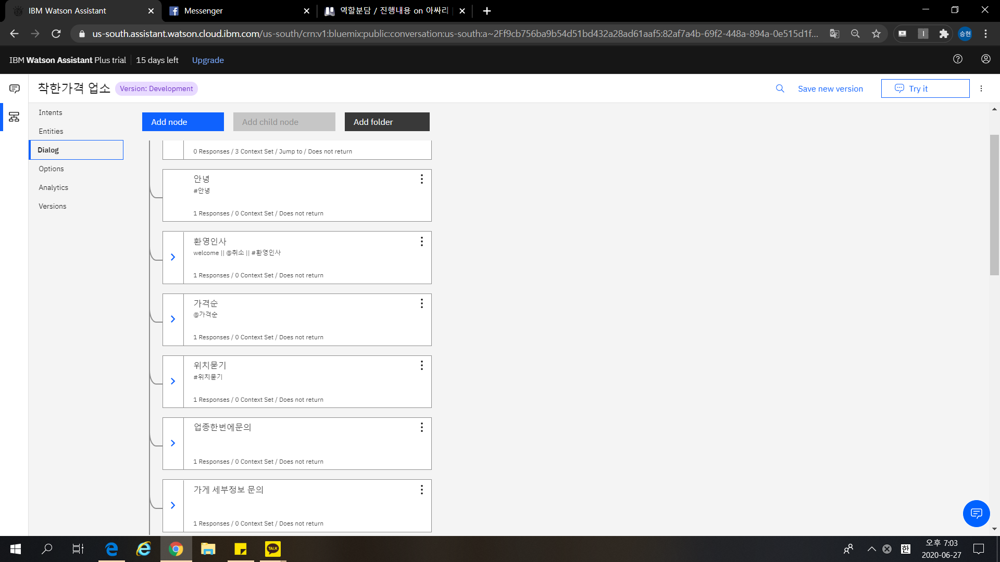
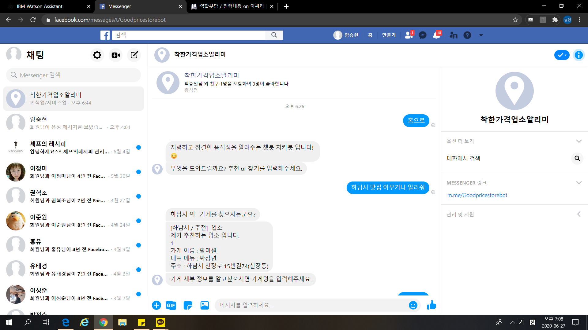

<h1 align="center" style="border-bottom: none;">🚀 <동국대학교 아싸리 팀> 인공지능을 이용한 챗봇구축</h1>
<h3 align="center">Watson Assistant를 이용하여, 착한 가격 업소를 추천하는 챗봇을 구축하였다.</h3>

<h3 align="center">로컬호스트 3000으로 실행했을때, 하남시의 중식을 알려주는 데모 스크린샷입니다.
"하남시 중식 알려줘"라는 해당 text 의 intent 는 "가게 추천"이 0.909%확률로 들어가고, 세부위치entity에 하남시가, 업종에 중식이 들어가서 그에 맞는 답변을 출력하는 형식으로 진행됩니다.</h3>

## 음성인식 구현과 한계

1. <h3 align="center">Watson의 Developer Tool을 이용해 Watson local Git hub에서 Speech to Text, Text to Speech 작업 코드 작성</h3>

1. <h3 align="center">Watson Developer 과 Assistant를 연결하여 Local app에서 동작 실행</h3>

1. <h3 align="center">한글 인식률의 부재, json 파일 구조 문제로 인한 음성인식 기술 구현 실패(영어로는 동작하지만, 한글로 동작하지 않음)</h3>

## Watson Assistant 구성

1. <h3 align="center">다음 사진과 같이 Intent, Entity, Dialog를 구성하여 챗봇을 학습시켰다.</h3>

2. <h3 align="center">Web Hook을 설정하여 CSV파일에서 가게의 정보를 찾아오도록 설계하였다.</h3>

3. <h3 align="center">Facebook Messenger과 연동하여 접근성을 향상시켰다.</h3>
